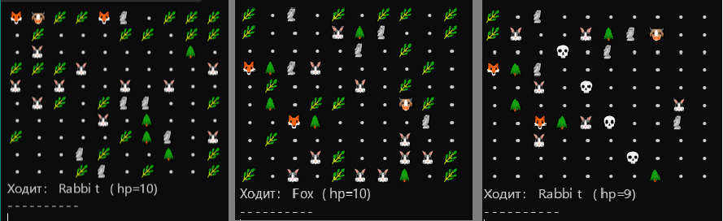

# Проект "Симуляция".

 

## Описание
- Проект моделирует поле, заполненное различными сущностями "живой" и "неживой" природы - деревьями, камнями, травой, хищниками и травоядными.
- Травоядные передвигаются по полю в поисках травы, хищники - в поисках травоядных.
- На поле имеются статические объекты, которые мешают проходу существ, также эти объекты образуются в ходе симуляции.
- Техническое задание проекта находится [тут.](https://zhukovsd.github.io/java-backend-learning-course/Projects/Simulation/)

## Правила симуляции
- Количество сущностей зависит от размеров поля, сущности расставляются в начале симуляции по случайным координатам.
- Травоядные представлены кроликами и коровами, которые ищут траву и мгновенно её съедают.
- Хищники представлены лисами, которые, в свою очередь, ищут кроликов и мгновенно их съедают. На коров лисы не охотятся.
- После смерти существа образуется новая сущность "кости".
- У существ имеется hp, которое уменьшается с каждым ходом, при падении hp до нуля существо погибает.
- Симуляция продолжается до момента смерти всех травоядных.
- Для принудительного выхода из симуляции необходимо закрыть терминал/консоль.

## Допущения
- Одинаковые скорости существ.
- Мгновенное уничтожение существ при атаке/поедании травы.

## Примечания
- Выравнивание сущностей в рендере настроено для отображения в Windows Terminal (протестировано для шрифта Segoe UI Emoji).
- Возможно при запуске в ином терминале/с иными шрифтами выравнивание работать не будет.
